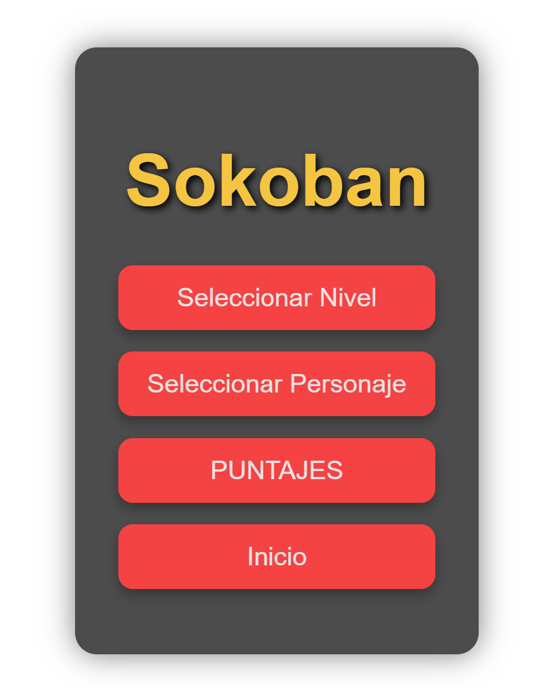
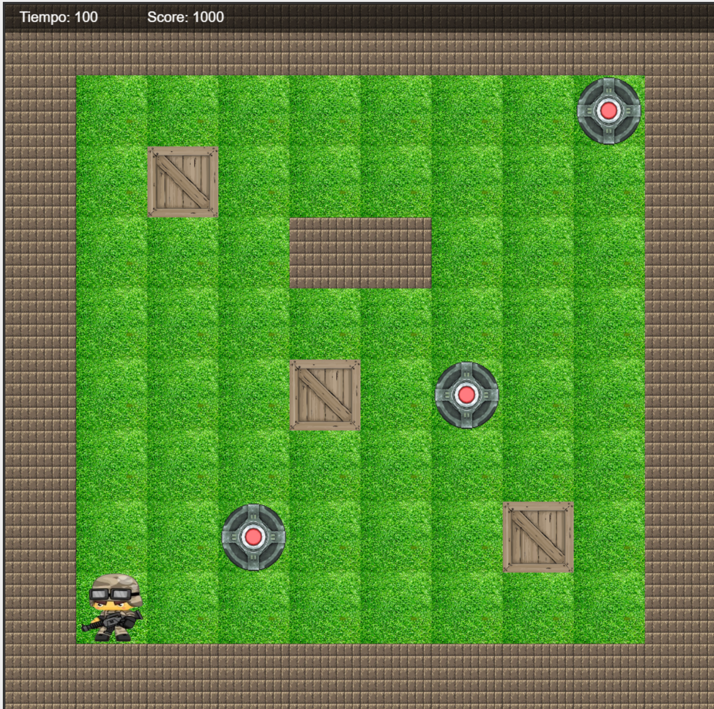

## 👨‍💻 Autores

-Hugo Giovani Morales Riglos
- Leonardo David Rivero Lope
- Proyecto de práctica de JavaScript y desarrollo web.

# Sokoban - Proyecto de Juego

Sokoban es un juego clásico de lógica y estrategia en el que el jugador debe mover cajas u objetos hasta ubicaciones objetivo en un tablero. Este proyecto es una versión web desarrollada con **HTML, CSS y JavaScript**, incluyendo manejo de niveles, selección de personajes, música de fondo y puntajes.

---

## 🎮 Características del Juego

- Tablero de 10x10 celdas.
- Selección de nivel y personaje desde un menú interactivo.
- Temporizador y sistema de puntuación.
- Sonido de fondo en bucle y efectos de movimiento.
- Pantalla de “Game Over” con sonido al perder.
- Avance de niveles automático y registro de los mejores puntajes en `localStorage`.
- Compatible con navegadores modernos.

---

## 🛠 Tecnologías Utilizadas

- **HTML5**: Estructura del juego y menús.
- **CSS3**: Estilos del menú, personajes y canvas.
- **JavaScript**: Lógica del juego, controles del jugador, temporizador, música y almacenamiento de puntajes.

---

## 📂 Estructura del Proyecto
/assets # Imágenes de personajes, celdas y sonidos
/sounds # Música y efectos de sonido
index.html # Menú principal y selección de personaje/nivel
sokoban.html # Canvas del juego
app.js # Inicialización del juego, carga de niveles e imágenes
game.js # Lógica del juego, controles, movimientos, temporizador y HUD
styles.css # Estilos adicionales si se usan

---

## ⚡ Cómo Jugar

1. Abre `index.html` en un navegador.
2. Selecciona tu **nivel** y **personaje**.
3. Ingresa tu **nombre** para guardar tu puntuación.
4. Usa las flechas del teclado para mover al jugador:
   - `↑` Arriba
   - `↓` Abajo
   - `←` Izquierda
   - `→` Derecha
5. El objetivo es mover todos los objetos a sus posiciones designadas (`celdas objetivo`).
6. Evita quedarte sin tiempo. Cuando el temporizador llegue a cero, aparece la pantalla de **Game Over**.
7. Al completar el nivel, tu puntuación se guarda y puedes avanzar al siguiente nivel.

---

## 🔊 Sonido y Música

- Música de fondo reproducida en bucle.
- Efectos de sonido:
  - Movimiento del jugador.
  - “Game Over” al perder.
- La música y efectos están en la carpeta `assets/sounds/`.

---

## 💾 Guardado de Puntajes

- Los puntajes se guardan en **localStorage** del navegador.
- Se registran los **10 mejores puntajes** con nombre del jugador.
- Se pueden consultar desde el menú principal.

---

## 📌 Notas sobre el Código

### app.js
- Inicializa el canvas y el juego.
- Carga el nivel seleccionado y reemplaza el jugador por el personaje elegido.
- Maneja la música de fondo y la pantalla de Game Over.

### game.js
- Controla la lógica del juego: movimientos, temporizador, dibujo del tablero y HUD.
- Comprueba condiciones de victoria y derrota.
- Guarda los puntajes y sube automáticamente de nivel al completar un nivel.

### index.html
- Contiene el menú principal y el menú de selección de personaje.
- Permite al usuario elegir nivel, personaje y registrar su nombre.

---

## 🔧 Cómo Ejecutar

1. Clona o descarga el repositorio.
2. Abre `index.html` en tu navegador.
3. Selecciona nivel y personaje, y comienza a jugar.

---
## 🖼 Capturas del Juego

Pantalla principal y selección de nivel/personaje:

Gameplay dentro del tablero:

## 📚 Posibles Mejoras

- Añadir más niveles y mapas personalizados.
- Animaciones de movimiento más suaves.
- Implementar guardado de progreso en la nube.
- Mejorar compatibilidad con dispositivos móviles.

---

